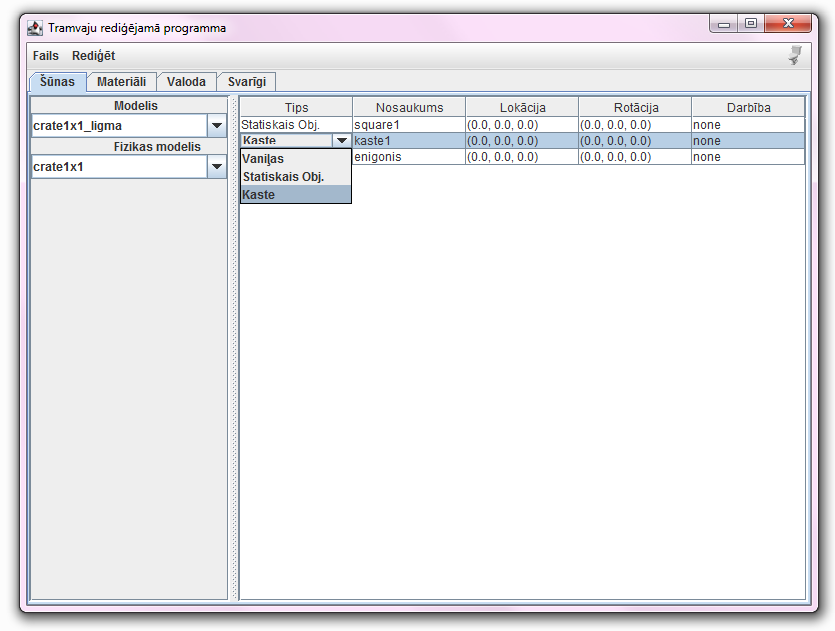
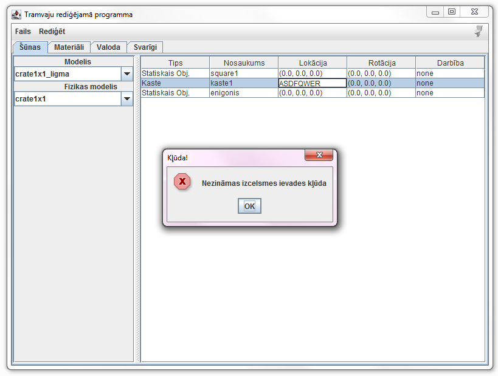
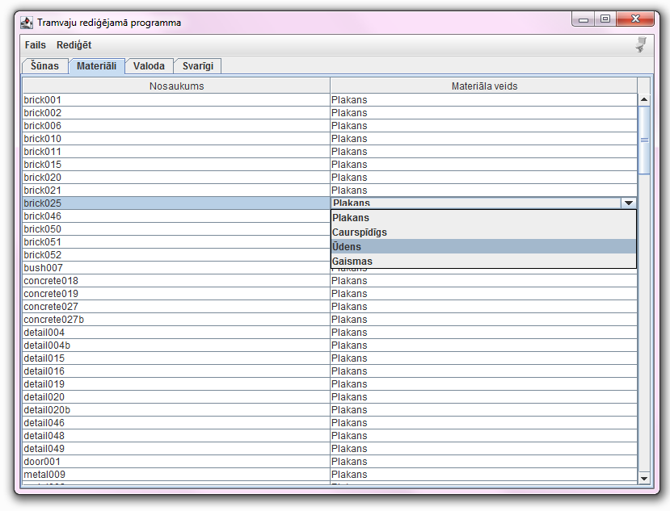
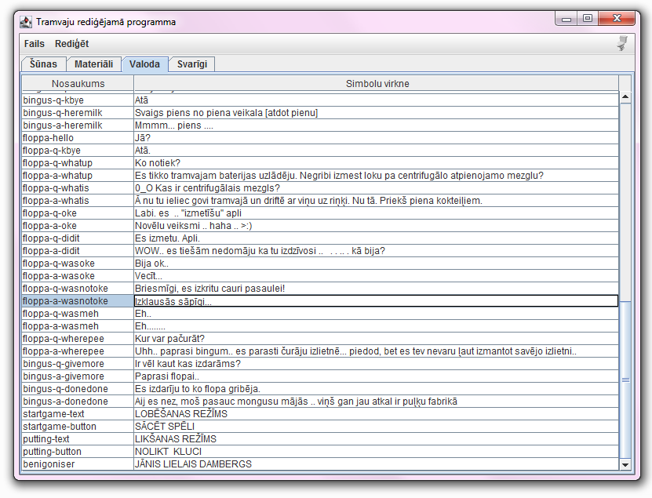

# Tramvaju rediģējamā programma

Tramvaju rediģējamās programmas prototips. Sastādīts Kotlin valodā kā pirmais mājasdarbs priekš *DatZ4019 : Objektorientētā programmēšana* (gandrīz visi dabūja 9, mani ieskaitot).

## Ekrānuzņēmumi

